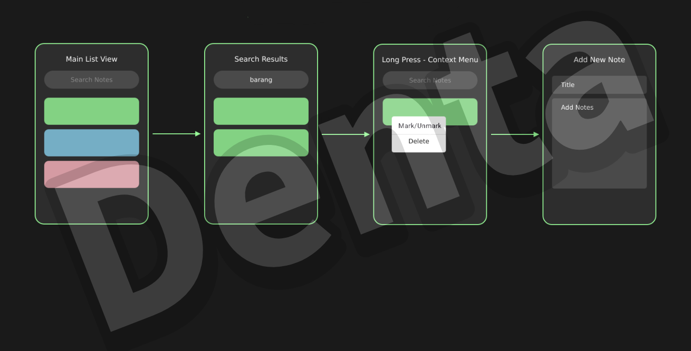

# UTS Pemrograman Mobile

### Nama : Denta Pramudya
### NIM  : 312310464
### Kelas: TI.23.A5

**1. Storyboard**

## 1. Pada Main List View, terdapat kolom pencarian yaitu search notes yang bisa digunakan untuk mencari notes yang diinginkan.
## 2. Pada Search Results, berisi hasil dari pencarian yang ditulis oleh user dari search notes.
## 3. Jika menekan lama pada bagian notes, maka terdapat opsi mark / unmark (untuk menandai notes dan menghapus mark pada note) dan delete (untuk menghapus note)
## 4. Jika mau Menambahkan note, maka terdapat title dan kolom add notes yang bisa diisi